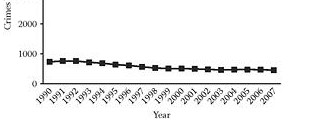
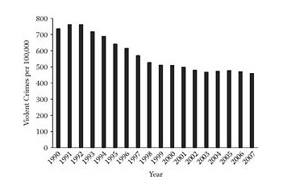

# Foreword
- 当大量数据汇总起来，其将很自然地失去那些个体化的数据。
    > i.e. <q>researchers generally use statistics to make ***general*** statements about a population</q> .

# Chapter 01 

### 四个基础概念

| term | explanation | example | 
| :--- | :--- | :--- | 
| Population | 总体 |
| parameter | 由总体 得出 (derived) 的数值 | e.g. *mean* | 
| sample | 样本  |
| statistic | 由样本得出的数值 | e.g. similar to *parameter* | 

### Note 
- samples are not necessarily good representations of the populations from which they were selected 
- the research (must) be able to determine how well the results from the sample ***generalize*** to the larger population
- Here’s two examples:   

### [Descriptive / Inferential] statistics  
- Descriptive statistics apply only to the members of a sample or population from which data have been collected.
- Inferential statistics refer to the use of sample data to reach some conclusions about the characteristics of the larger population that the sample is supposed to represent.

### [Random / Representative / Convenience] sampling 
- random sampling 
    1. note the “random” means that every member of a population has an equal chance of being selected into a sample. (it does  NOT mean *haphazard*)
    2. although randomly selected samples may differ from the larger population in important ways, these differencees are due to ***chance*** rather than to a systematic bias in the selection process.

- representative sampling
    1. the researchers purposely selects cases so that they will match the larger population on specific characteristics.
    2. its procedures can be costly and time-consuming, but it increases (my) chances of being able to generalize the results from (my) sample to the population. (i.e. accuracy)
    3. example 
        > “ if 15% of the adult population in San Francisco is retired, I would select my sample in a manner that included 15% retired adults. Similarly, if 55% of the adult population in San Francisco is male, 55% of my sample should be male. “

- conveniently sampling 
    1. the researcher generally select participants on the basis of *proximity*, *ease-of-access*, and *willingness to participate* (i.e. convenience).
    2. it doesn’t always a bad way to select a sample (XD) if the sample does not differ from my population of interest in ways that influence the outcome of the study (at least acceptable)

### [Quantitative / Qualitative] variables 
- quantative variable
    1. or continuous 
    2. e.g. height 

- qualitative variable 
    1. or categorical 
    2. a certain quality 
    3. even there’s assigned values, it does not indicated more or less of a certain quality (e.g. place{0,1,2} place{home,school,work} )
    4. there’s special cases like *dichotomous variable*. examples like *male/female*, *dead/not-dead* etc.

### four different scales of measurement for variables 
- nominal 
    1. 象征性的, 名称上的
    2. e.g. 以 0,1 代表 male/female
- ordinal 
    1. 顺序, 程度
    2. e.g. 以 1~9 代指 富裕程度  (soso <-> richest)
    3. well, it got weight. But it does NOT indicate *how this man is richer than that man* (i mean, xxx dollars?)
    4. 允许不等距 (对应下边的例子)
- interval/ratio 
    - just like the *ordinal* 
    - but the interval (length/distance etc.) of *1 to 2*, or *5 to 6* and else are all the ***same*** (e.g. 500 dollars, 10 seconds etc.)

### [Experimental / Correlational] research designs 
- experimental research design 
    1. The experimenter divides the cases in the sample into different groups and compares the groups on one or more variables 
    2. it ***does experiment***.
    3. It’s good cuz it allow the researchers to isolate specific *independent variables* than might cause variation, or changes in *dependent variables*.
    4. but it might be ***difficult to accomplish in a clean way*** and they often do not generalize to real-world situations.

- correlational research design 
    1. The researcher typically does not actually manipulate anything.
    2. rather, they simply collects data on several variables and then conducts some statistical analyses to determine how strongly different variables are related to each other.
    3. Well, it can only tell us whether the var are related to each other -- they cannot lead to conclusions about ***causality***.
    4. example 
        > e.g. two cases  (comparison)
        
        > [0] a more rested employee will be able to work harder and more efficiently.

        > [1] Getting one’s work done may relieve stress and perhaps even allows the worker to sleep in a little longer 
    5. It’s *easy* to be done. 
    6. but the principle drawback of it, is that such research does not allow for (who not allow? your purpose and clean method does it) the careful controls necessary for drawing conclusions about causal associations between variables.
        > 说白话: *易*做 但受限于不能变更关键性数值。(你若如此，则“违反”了 correlational design 最初的意图或是意向)
        
### Distributions 
- what is it 
    - simply a collection of data, or scores, on a variables 
- like what 
    - usually, these scores are **arranged in order** from min->max  and they *can be* presented graphically.
- advice about making *graph*
    - keep in mind that the purpose of the graph is to make the data ***easy to understand/see*** (if not, then it’s not that good)

### Three things we’ve missed 
- Chi-square distributions 
- F distributions 
- t distributions 