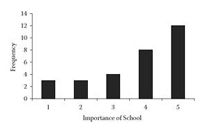
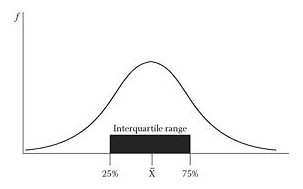
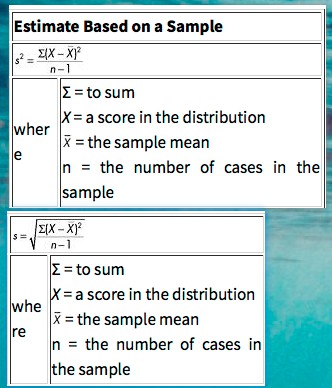

# Chapter 02 

### Central Tendency
- It’s a ***type***.
- It includes *mean*, *mode*, *median* and so on.

### Mode 
- If there’s two *modes*, it was called ***multimodal*** distribution.
- There’s a special (example) one: *bimodal distribution* <small>(双峰分布)</small>.

### Skewed Distribution 
- Here’s an ***negatively skewed*** 
    > For values, the *mean* is lower than the *median*.
- **Vice versa**.

# Chapter 03 

### Foreword 
- From *chapter 02*, we cannot get enough info by using the methods from it.
- We need a much powerful weapon!

### Range 
- Simply put, it equals *max - min*. 
- And there’s an ***interquartile range*** (aka *IQR*) 
    - Well, the ***Boxplot*** is just for it!

### Variance 
- As a “*foreplay*” of the following calculations.
- Why we need it
    - Ya need to get the stddev. (Well, yes.)
    - Ya need to use it in other advanced calculations. (e.g. *ANOVA*, *regression* etc.)

### Standard Deviation 
- For one difference, that’s *variance*.
    - For all differences, that’s **standard** *deviation*. (avg difference)
- If the avg of the distribution is 10, and there’s a val is 12. 
    > Then we called the *deviation* is **2**.
- Here’s the formula (for **sample**)
    > 
- About the formula 
    - Squared deviation is *variance* (if being squared root => stddev).
    - If what u want is the *population*, ya need to change the *mean* and the *n-1* to *N*.
    - The 2 is caled before the *sum*, and it’s necessary for **avoiding the zero**.
